# NeevAI — AI-Powered Infrastructure Decision Intelligence Platform

> **Smart India Hackathon 2026 · SIH26103 · AI for Infrastructure Monitoring**

NeevAI is an AI-powered **decision-intelligence layer for infrastructure project monitoring**. It transforms project-monitoring data into predictions, risk signals, early warnings, comparative insights, forecasts and grounded project intelligence.

### Core Product Flow

```text
                ┌──────────────────┐
                │ Project Data     │
                │ & Snapshots      │
                └────────┬─────────┘
                         ↓
                ┌──────────────────┐
                │ Data / Analytics │
                └────────┬─────────┘
                         ↓
                ┌──────────────────┐
                │ Prediction       │
                │ + Forecasting    │
                └────────┬─────────┘
                         ↓
                ┌──────────────────┐
                │ Risk & Early     │
                │ Warning          │
                └────────┬─────────┘
                         ↓
                ┌──────────────────┐
                │ Explain &        │
                │ Compare          │
                └────────┬─────────┘
                         ↓
                ┌──────────────────┐
                │ Decision         │
                │ Support          │
                └──────────────────┘
```

---

# 1. What Problem Does NeevAI Solve?

Infrastructure projects can experience:

- Cost escalation
- Schedule delays
- Slow physical progress
- Financial/physical progress imbalance
- Milestone delays
- Execution-risk signals
- Repeated schedule or cost revisions
- Implementation bottlenecks

Traditional monitoring primarily answers:

> **What is happening now?**

NeevAI extends this with:

> **What may happen next?**  
> **Why is the project showing risk?**  
> **How does it compare with similar projects?**  
> **What should the monitoring team review?**

The objective is to move infrastructure monitoring from **descriptive monitoring** toward **predictive and decision-support monitoring**.

---

# 2. SIH26103 Context

The SIH26103 problem statement focuses on an AI-powered Predictive Analytics and Early Warning System for infrastructure project monitoring.

The stated scope includes:

- Cost-overrun prediction
- Time-overrun prediction
- Project risk scoring
- Early-warning alerts
- Benchmarking and comparative analytics
- Cost-escalation driver analysis
- AI-powered monitoring dashboard
- Project intelligence / LLM-enabled assistance
- Documentation and deployment

The problem statement also asks for evaluation of:

1. Statistical and predictive models.
2. AI/ML approaches versus conventional statistical approaches.
3. Current project-monitoring/CUF fields versus additional variables not currently captured.

NeevAI is implemented around these requirements.

---

# 3. NeevAI Positioning

NeevAI should be understood as a **decision-intelligence layer over infrastructure project-monitoring data**.

```text
┌───────────────────────────────┐
│ Infrastructure Monitoring     │
│ / PAIMANA Data                │
│                               │
│ What happened?                │
│ What is happening?            │
└───────────────┬───────────────┘
                │
                ▼
┌───────────────────────────────┐
│            NeevAI              │
│                               │
│ Predict                       │
│ Score Risk                    │
│ Detect Early Warnings         │
│ Forecast                      │
│ Explain                       │
│ Compare                       │
│ Simulate                      │
│ Recommend / Prioritise        │
└───────────────┬───────────────┘
                │
                ▼
┌───────────────────────────────┐
│ Monitoring / Decision Support │
└───────────────────────────────┘
```

**Important:** NeevAI does not currently claim a live external PAIMANA synchronization. The architecture supports continuously updated project data, while direct live PAIMANA integration remains a future enhancement.

---

# 4. Current Production Status

## Implemented

### Application

- React + TypeScript production frontend
- Project monitoring dashboard
- Project listing
- Project search/filtering
- Project Details
- Project snapshots/history
- Add Project
- Edit Project
- Dashboard refresh
- Loading/error states
- Analytical charts
- Responsive desktop-oriented UI

### Backend

- FastAPI REST backend
- Firestore persistence
- Project CRUD APIs
- Snapshot CRUD APIs
- Derived metric APIs
- Recalculation API
- Prediction APIs
- What-if simulation API
- Project Intelligence APIs
- Backend health endpoint
- Swagger/OpenAPI documentation

### AI / ML

- Cost-overrun prediction
- Time-overrun prediction
- ML risk prediction
- Deterministic execution-risk engine
- Early-warning signals
- Benchmarking/comparative analytics
- Cost-escalation signal analysis
- Next-month physical-progress forecasting
- Grounded Project Intelligence
- Temporal model evaluation
- Statistical vs ML comparison

### Deployment

- Frontend deployed on Vercel
- Backend deployed on Render
- Firestore used as production persistence
- Production API health verified
- Production frontend data loading verified

---

# 5. High-Level Architecture

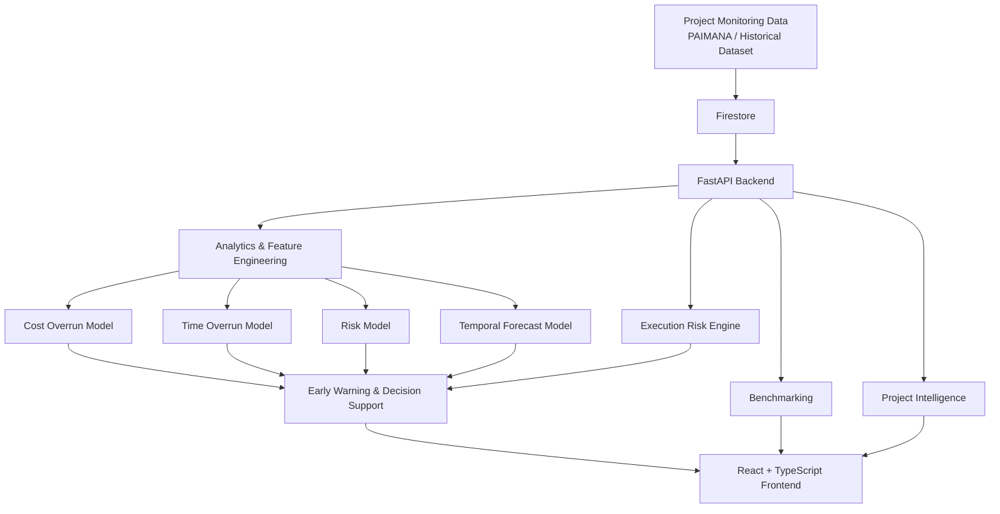

---

# 6. Production Architecture

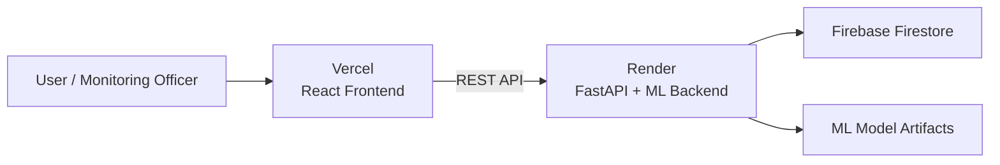

### Production components

| Component | Technology | Responsibility |
|---|---|---|
| Frontend | React + TypeScript | User interface and interaction |
| API | FastAPI | REST endpoints and orchestration |
| ML | Python + scikit-learn | Prediction and forecasting |
| Database | Firebase Firestore | Project/snapshot/metric persistence |
| Frontend Hosting | Vercel | Production web application |
| Backend Hosting | Render | API + ML service |
| Charts | Recharts | Analytical visualization |

---

# 7. End-to-End System Flow

```text
                PROJECT DATA
                     │
                     ▼
             ┌───────────────┐
             │   Firestore   │
             └───────┬───────┘
                     │
                     ▼
             ┌───────────────┐
             │ FastAPI API   │
             └───────┬───────┘
                     │
          ┌──────────┼───────────┐
          │          │           │
          ▼          ▼           ▼
      Analytics    ML Models   Snapshots
          │          │           │
          │    ┌─────┼─────┐     │
          │    │     │     │     │
          │    ▼     ▼     ▼     │
          │  Cost   Time  Risk   │
          │  Model  Model Model  │
          │    │     │     │     │
          └────┴─────┴─────┘     │
                     │           │
                     ▼           ▼
              ┌─────────────────────┐
              │ Risk + Early Warning │
              └──────────┬──────────┘
                         │
            ┌────────────┼─────────────┐
            ▼            ▼             ▼
       Benchmarking  Forecasting   Intelligence
            │            │             │
            └────────────┼─────────────┘
                         ▼
                 ┌─────────────┐
                 │   Dashboard │
                 └─────────────┘
```

---

# 8. Core Product Workflow

The central NeevAI workflow is:

```text
DATA
  ↓
ANALYSIS
  ↓
PREDICTION
  ↓
RISK ASSESSMENT
  ↓
EARLY WARNING
  ↓
EXPLANATION
  ↓
COMPARISON
  ↓
RECOMMENDATION
  ↓
DECISION SUPPORT
```

This is the main concept to use when explaining NeevAI to a new developer, judge or team member.

---

# 9. Project-Level Workflow

When a user opens a project:

```text
Select Project
     ↓
Load Project Master Data
     ↓
Load Latest Snapshot
     ↓
Load Historical Snapshots
     ↓
Calculate / Load Derived Metrics
     ↓
Load ML Predictions
     ↓
Load Next-Month Forecast
     ↓
Calculate / Load Risk
     ↓
Generate Early-Warning Signals
     ↓
Load Benchmarking Context
     ↓
Load Project Intelligence
     ↓
Render Project Details
```

---

# 10. Project Details Architecture

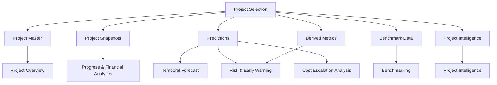

---

# 11. Data Architecture

NeevAI uses Firebase Firestore.

```text
Firestore
│
├── projects/
│
├── projectSnapshots/
│
├── derivedMetrics/
│
└── recalcLogs/
```

## 11.1 `projects`

Stores project master information.

Typical fields:

```text
projectId
projectName
domain
projectType
ministry
implementingAgency
state
districtOrLocation
approvalDate
startDate
originalCostCr
originalCompletionDate
dataSource
sourceProjectCode
createdAt
updatedAt
```

## 11.2 `projectSnapshots`

Stores periodic project-monitoring records.

Typical fields:

```text
projectId
reportType
reportPeriod
reportDate

originalCostCr
revisedCostCr
cumulativeExpenditureCr
physicalProgressPct

totalMilestones
completedMilestones
delayedMilestones

originalCompletionDate
anticipatedCompletionDate
revisedCompletionDate

health
projectStatus
```

A new reporting period should normally create a new snapshot instead of overwriting historical information.

## 11.3 `derivedMetrics`

Stores calculated metrics for a project snapshot.

Example:

```text
projectId
snapshotId
financialProgress
physicalProgress
costVariance
expectedVelocity
actualVelocity
scheduleVariance
riskComponents
overallRiskScore
riskLevel
```

The deterministic derived-metric ID follows:

```text
projectId__snapshotId
```

## 11.4 `recalcLogs`

Stores the status of backend recalculation operations.

```text
started
   ↓
processing
   ↓
completed
```

or:

```text
started
   ↓
failed
```

---

# 12. Why Snapshots Matter

NeevAI uses a snapshot-based design.

Instead of:

```text
Project → Current Data
```

the system supports:

```text
Project
   ├── Snapshot 1
   ├── Snapshot 2
   ├── Snapshot 3
   └── Snapshot N
```

This enables:

- Historical progress analysis
- Schedule movement
- Expenditure movement
- Velocity calculation
- Risk trends
- Temporal forecasting
- Before/after comparison

The temporal flow is:

```text
Snapshot T1
    ↓
Snapshot T2
    ↓
Snapshot T3
    ↓
Observed Trend
    ↓
Forecast
```

---

# 13. Machine Learning Architecture

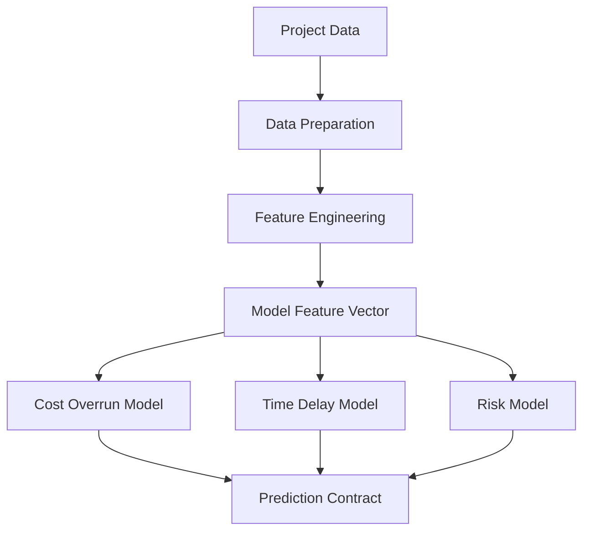

Current model families include Gradient Boosting and Random Forest based prediction components.

---

# 14. Feature Engineering

The current prediction pipeline uses 24 model features:

```text
original_cost_cr
revised_cost_cr
cumulative_expenditure_cr
physical_progress_pct
financial_progress_pct
total_milestones
completed_milestones
delayed_milestones
land_acquisition_delay_months
clearance_delay_months
contractor_delay_score
geological_delay_score
cost_escalation_ratio
fin_phy_progress_gap
milestone_delayed_ratio
milestone_completion_rate
statutory_clearance_burden
execution_friction_index
capex_scale_log
sector_encoded
state_clearance_factor
financial_burn_ratio
milestone_stress_index
clearance_execution_synergy
```

### Important

Some supplementary indicators in this feature vector are prototype/unverified inputs.

NeevAI does **not** claim that all 24 features are official PAIMANA/CUF fields.

---

# 15. Prediction Contract

The prediction service standardizes its output:

```json
{
  "predicted_delay_months": 0,
  "predicted_cost_overrun_pct": 0,
  "predicted_cost_overrun_cr": 0,
  "predicted_risk_score": 0,
  "risk_category": "LOW",
  "model_version": "2.1.0",
  "feature_count": 24
}
```

## Safety bounds

```text
Delay:
0–72 months

Cost overrun:
0–80%

Risk:
10–99
```

---

# 16. Cost Overrun Prediction

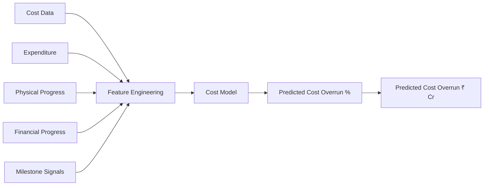

The model estimates:

- Cost-overrun percentage
- Cost-overrun amount in ₹ Crore

These are predictions, not guaranteed outcomes.

---

# 17. Time Overrun Prediction

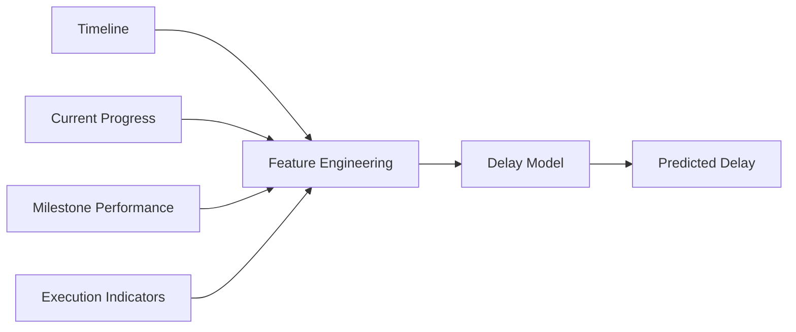

Primary output:

```text
predicted_delay_months
```

---

# 18. Risk Architecture

NeevAI has two complementary risk concepts.

## 18.1 ML Risk

The ML model provides:

```text
Predicted Risk Score
        ↓
Risk Category
```

Categories:

```text
< 25       LOW
25–49.99   MEDIUM
50–74.99   HIGH
≥ 75       CRITICAL
```

## 18.2 Execution Risk

The backend deterministic risk engine calculates observed execution risk from project performance.

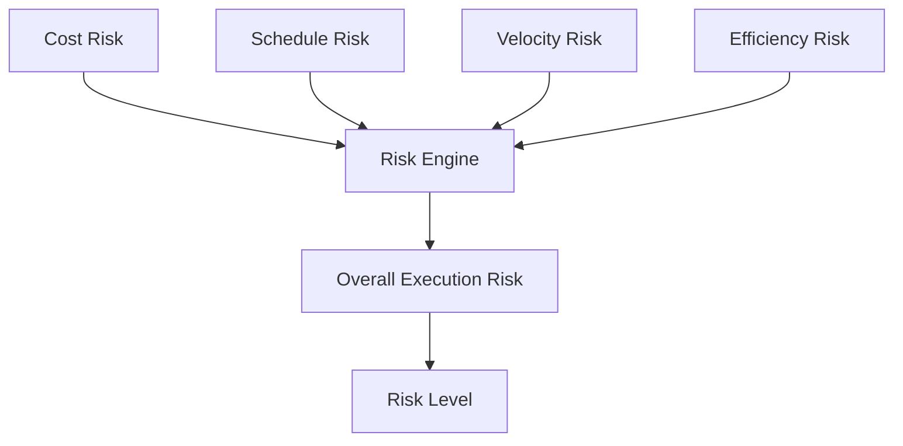

Weights:

```text
Cost Risk        30%
Schedule Risk    30%
Velocity Risk    20%
Efficiency Risk  20%
```

Formula:

```text
Overall Risk
=
0.30 × Cost Risk
+ 0.30 × Schedule Risk
+ 0.20 × Velocity Risk
+ 0.20 × Efficiency Risk
```

The ML risk score and execution-risk score are distinct and should not be presented as the same metric.

---

# 19. Recalculation Flow

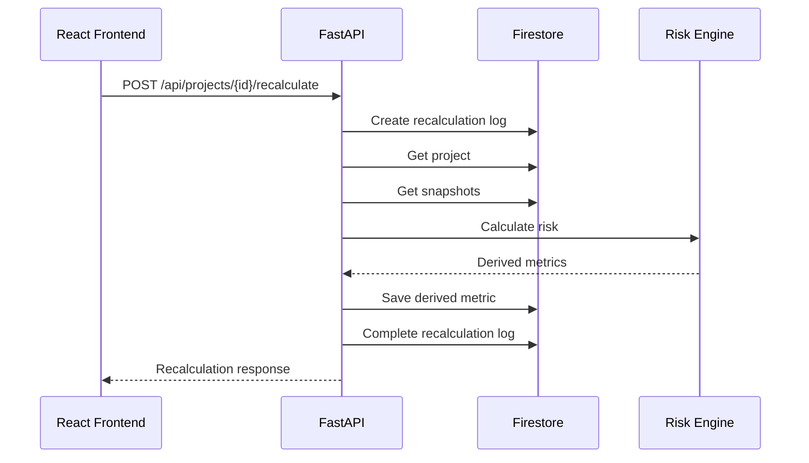

---

# 20. Temporal Progress Forecasting

NeevAI includes a temporal next-month physical-progress model.

Current model:

| Property | Value |
|---|---|
| Model | Gradient Boosting Regressor |
| Version | temporal-progress-1.0.0 |
| Training Window | May 2026 |
| Test Window | June 2026 |
| Training Rows | 1,700 |
| Test Rows | 1,700 |
| Features | 10 |
| MAE | 1.95 percentage points |
| R² | 0.9829 |

### Correct interpretation

R² = 0.9829 is **not** “98.29% accuracy”.

It means the evaluated model achieved an R² of 0.9829 on the specified temporal evaluation window.

---

# 21. Statistical vs ML Evaluation

NeevAI evaluates conventional and ML approaches on a common temporal evaluation window.

| Model | MAE | RMSE | R² |
|---|---:|---:|---:|
| Linear Regression | 2.0960 | 4.1838 | 0.9840 |
| Gradient Boosting | 1.9481 | 4.3210 | 0.9829 |

### Interpretation

On this evaluation window:

- Gradient Boosting has lower MAE.
- Linear Regression has lower RMSE.
- Linear Regression has slightly higher R².

Therefore NeevAI does **not** claim that ML is universally superior to conventional statistical methods.

---

# 22. Early Warning System

The early-warning layer combines:

```text
ML Predictions
      +
Execution Risk
      +
Temporal Trends
      +
Project Indicators
      ↓
Early Warning Signals
```

Example conceptual flow:

```text
High Predicted Delay
        ↓
Schedule Warning
```

```text
High Cost Overrun Prediction
        ↓
Cost Warning
```

```text
Large Progress Gap
        ↓
Progress Deviation Warning
```

The system is intended to help monitoring teams prioritize review and intervention.

It does not autonomously make government decisions.

---

# 23. Benchmarking & Comparative Analytics

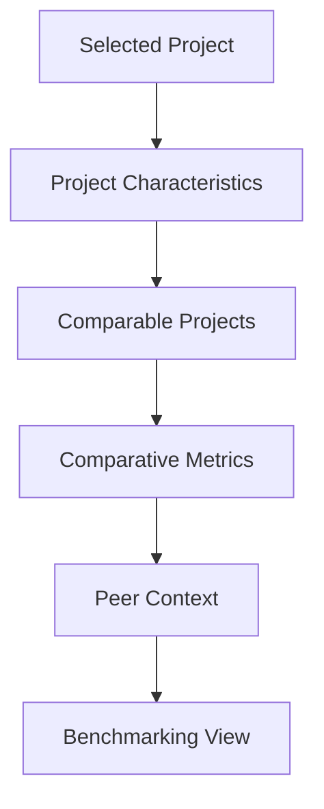

Benchmarking answers:

> **How does this project compare with relevant projects available in the system?**

It provides context rather than an absolute ranking or judgement.

---

# 24. Cost Escalation Driver Analysis

NeevAI provides project-level cost escalation analysis using available project indicators.

The interpretation should follow:

```text
Observed Project Data
        ↓
Derived Indicators
        ↓
Model / Analytical Signals
        ↓
Potential Drivers
```

The platform deliberately avoids claiming that a correlated variable is automatically a proven causal factor.

Where supplementary inputs are unverified, they are treated as **signals/prototype inputs**, not confirmed official causes.

---

# 25. Project Intelligence

NeevAI provides a grounded project-specific intelligence layer.

Current API:

```text
GET
/api/project-intelligence/{project_id}

POST
/api/project-intelligence/{project_id}/ask
```

## Flow

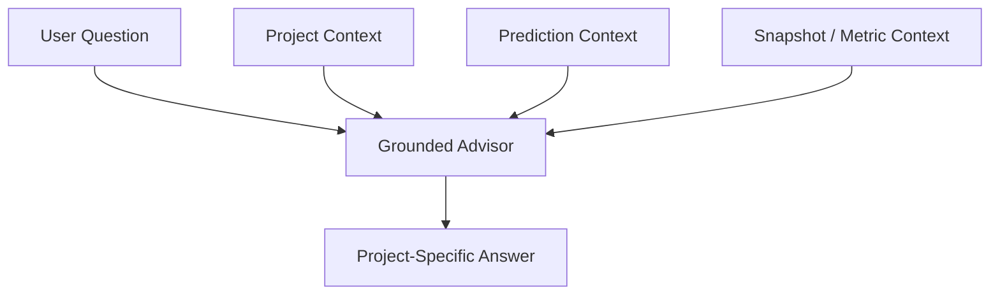

### Example

User:

> Why is this project at risk?

The advisor uses available project and prediction evidence instead of inventing unavailable causes.

### Grounding principles

- Use stored project information.
- Use exact prediction outputs.
- Use available snapshot/metric data.
- Do not invent missing project variables.
- Do not claim potential drivers are proven causes.

---

# 26. What-if Simulation

NeevAI exposes a prediction simulation API.

```text
User changes scenario input
          ↓
Simulation request
          ↓
Prediction engine
          ↓
Scenario prediction
          ↓
User compares result
```

Simulation does not overwrite the actual project record.

It should be interpreted as:

> **Model-based scenario analysis**

rather than a guaranteed future outcome.

---

# 27. Frontend Service Architecture

The frontend communicates with the backend through dedicated services.

```text
frontend/
│
├── services/
│   ├── projectService
│   ├── projectSnapshotService
│   ├── predictionService
│   ├── recalcService
│   ├── benchmarkService
│   ├── derivedMetricService
│   ├── projectAnalyticsService
│   └── projectIntelligenceService
│
└── pages/components/
```

### Important architectural rule

The frontend does not directly access Firestore.

The flow is:

```text
React
  ↓
Frontend Service
  ↓
FastAPI
  ↓
Firestore / ML / Analytics
```

This keeps backend logic centralized.

---

# 28. Backend API Architecture

Core production routes include:

| Method | Endpoint | Purpose |
|---|---|---|
| GET | `/` | Service information |
| GET | `/health` | Backend/model health |
| GET | `/api/projects` | List projects |
| POST | `/api/projects` | Create project |
| PATCH | `/api/projects/{id}` | Update project |
| DELETE | `/api/projects/{id}` | Delete project |
| GET | `/api/projects/document/{id}` | Get project |
| GET | `/api/projects/{id}/snapshots` | Get project snapshots |
| POST | `/api/projects/{id}/snapshots` | Create snapshot |
| GET | `/api/snapshots` | List snapshots |
| PATCH | `/api/snapshots/{id}` | Update snapshot |
| DELETE | `/api/snapshots/{id}` | Delete snapshot |
| GET | `/api/projects/{id}/snapshots/{snapshotId}/derived-metric` | Get derived metric |
| POST | `/api/projects/{id}/recalculate` | Recalculate project |
| GET | `/api/predictions/project/{id}` | Get ML prediction |
| GET | `/api/predictions/project/{id}/next-month-progress` | Get progress forecast |
| POST | `/api/predictions/simulate` | Run what-if simulation |
| GET | `/api/project-intelligence/{id}` | Get project intelligence |
| POST | `/api/project-intelligence/{id}/ask` | Ask project intelligence |

---

# 29. API Request Flow

Generic read flow:

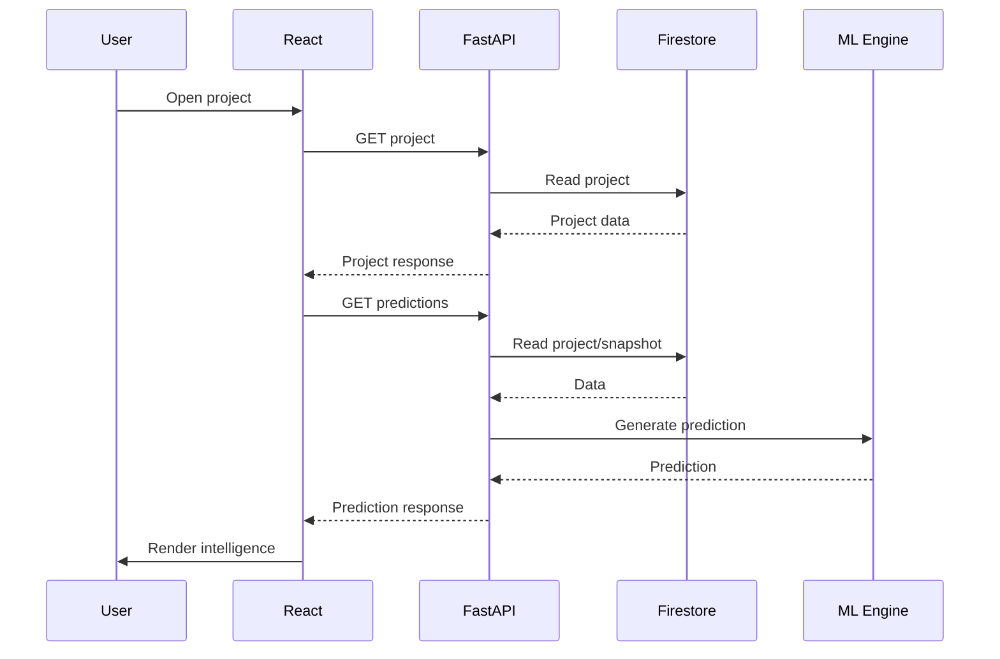

---

# 30. Production Health Flow

Backend health is available at:

```text
GET /health
```

Expected structure:

```json
{
  "status": "healthy",
  "models": {
    "delay_model": true,
    "cost_model": true,
    "risk_model": true,
    "metadata": true
  }
}
```

This verifies that the backend is alive and the required model artifacts are available.

---

# 31. Data Integrity Rules

NeevAI follows these rules:

### Do not fabricate source data

Missing official values must not be silently invented.

### Preserve historical records

Use snapshots rather than overwriting previous reporting periods when temporal analysis is required.

### Preserve source traceability

Where source metadata exists, retain it.

### Distinguish data types

Every value should be understood as one of:

```text
Verified source data
        OR
Prototype/manual input
        OR
Derived metric
        OR
Model prediction
```

### Do not confuse prediction with fact

```text
Prediction ≠ Actual Outcome
```

---

# 32. Data Sufficiency / Challenge C

The current canonical dataset contains:

```text
5,609 project-month observations
2,045 unique projects
18 core fields
```

A Challenge C audit checked:

```text
16 candidate additional variables
```

Result:

```text
0 / 16 verified as present
```

No synthetic values were used to make those variables appear available.

This is important because NeevAI should not claim access to data that is not actually available.

---

# 33. Security Architecture

```text
Frontend
   │
   │ HTTPS
   ▼
FastAPI
   │
   ├── ML Models
   │
   └── Firestore
```

Important security rules:

- Firebase service-account credentials remain backend-side.
- Service-account files must never be committed.
- Production credentials should be provided through environment variables.
- Frontend should not contain private Firebase Admin credentials.
- API access should remain centralized through backend services.

---

# 34. Environment Configuration

Frontend production uses:

```env
VITE_API_BASE_URL=https://neevai-sx26.onrender.com
```

Backend production uses Firebase credentials through an environment configuration mechanism.

Never put private credentials inside:

- README
- frontend source
- GitHub
- public documentation
- screenshots

---

# 35. Local Development

## Backend

From the project root:

```bash
pip install -r backend/requirements.txt
```

Run:

```bash
python -m uvicorn backend.main:app --host 127.0.0.1 --port 8000
```

Health check:

```text
http://127.0.0.1:8000/health
```

Swagger:

```text
http://127.0.0.1:8000/docs
```

## Frontend

Install dependencies:

```bash
npm install
```

Configure:

```env
VITE_API_BASE_URL=http://127.0.0.1:8000
```

Then run the project's frontend development command.

---

# 36. Production Deployment

## Backend — Render

Current deployment pattern:

```text
Build:
pip install -r requirements.txt
```

```text
Start:
uvicorn backend.main:app --host 0.0.0.0 --port $PORT
```

Production backend:

```text
https://neevai-sx26.onrender.com
```

## Frontend — Vercel

Configure:

```env
VITE_API_BASE_URL=https://neevai-sx26.onrender.com
```

Then redeploy the frontend after environment-variable changes.

---

# 37. Production Verification

Verified production flow:

```text
Vercel Frontend
      ↓
Render Backend
      ↓
Firestore
      ↓
ML Models
      ↓
Prediction / Risk / Intelligence
      ↓
Vercel UI
```

Verified:

- Backend health
- ML model loading
- Swagger API
- Production API response
- Production project data loading
- Project details
- Prediction services
- Production frontend/backend connection
- Backend recalculation
- Derived metric persistence

---

# 38. Example Recalculation Flow

For a project:

```text
Project 617887
      ↓
Find latest snapshot
      ↓
Find previous snapshot
      ↓
Calculate:
  Financial Progress
  Cost Variance
  Expected Velocity
  Actual Velocity
  Schedule Variance
  Risk Components
      ↓
Calculate Overall Risk
      ↓
Persist Derived Metric
      ↓
Update Recalculation Log
```

---

# 39. Testing Philosophy

NeevAI testing focuses on:

### Functional testing

- Project creation
- Project editing
- Project retrieval
- Snapshot creation
- Snapshot editing/deletion
- Prediction retrieval
- Recalculation
- What-if simulation
- Intelligence Q&A

### ML testing

- Model loading
- Feature count
- Prediction contract
- Output bounds
- Temporal evaluation

### Integration testing

```text
Frontend
   ↓
API
   ↓
Firestore
   ↓
ML
```

### Production testing

```text
Production Frontend
        ↓
Production API
        ↓
Production Database
        ↓
Production ML
```

---

# 40. Current Limitations

NeevAI should currently be presented with the following limitations:

1. Live external PAIMANA synchronization is not currently implemented.
2. Some supplementary project indicators are prototype/unverified inputs.
3. Challenge C did not find verified values for the checked additional variables.
4. Temporal model metrics correspond to the evaluated temporal window.
5. Model predictions are decision-support estimates, not guarantees.
6. Correlation/model importance must not automatically be interpreted as causation.
7. Healthcare-specific ML training is not currently presented as a verified deployed model.
8. Mobile responsiveness is intentionally deferred from the current finalized scope.

---

# 41. Future Scope

Possible future extensions include:

- Authorized live PAIMANA/API integration
- Longer temporal validation
- Automated model retraining
- Model drift monitoring
- Data drift monitoring
- More sector-specific models after verified training data preparation
- External validation of additional variables
- More advanced causal analysis
- Expanded reporting/export
- Enterprise authentication and role-based access
- Mobile-responsive optimization
- More advanced LLM integration
- Automated intervention workflows

---

# 42. Demo Storyline

A strong NeevAI demonstration should follow:

```text
1. Open Dashboard
       ↓
2. Select Project
       ↓
3. Show Current Progress
       ↓
4. Show AI Risk
       ↓
5. Show Cost Prediction
       ↓
6. Show Time Prediction
       ↓
7. Show Next-Month Forecast
       ↓
8. Show Early Warnings
       ↓
9. Explain Risk
       ↓
10. Compare Similar Projects
       ↓
11. Run What-if Scenario
       ↓
12. Ask Project Intelligence
       ↓
13. Show Recalculation / Derived Metrics
```

### Core demo narrative

```text
DATA
 ↓
ANALYSIS
 ↓
PREDICTION
 ↓
EXPLANATION
 ↓
COMPARISON
 ↓
ACTION
```

---

# 43. Example Judge Explanation

### What is PAIMANA?

PAIMANA is the infrastructure project-monitoring ecosystem described in the SIH problem statement. NeevAI uses project-monitoring information as the analytical foundation for predictive decision support.

### What does NeevAI add?

NeevAI adds:

- Prediction
- Risk scoring
- Early warnings
- Forecasting
- Explainability
- Benchmarking
- Scenario simulation
- Project intelligence

### How is risk calculated?

NeevAI uses both:

1. ML-based project risk prediction.
2. A deterministic execution-risk framework using cost, schedule, velocity and efficiency signals.

### Is NeevAI real-time?

The architecture supports continuously updated project data, but live external PAIMANA synchronization is a future integration rather than a currently implemented live feed.

### Is every supplementary field official PAIMANA data?

No. NeevAI explicitly distinguishes core project-monitoring data from supplementary prototype/unverified inputs.

---

# 44. Repository Organization

A conceptual project structure is:

```text
NeevAI/
│
├── frontend/
│   ├── src/
│   │   ├── components/
│   │   ├── pages/
│   │   ├── services/
│   │   ├── types/
│   │   └── ...
│   └── package.json
│
├── backend/
│   ├── main.py
│   ├── firebase/
│   │   └── firestore_service.py
│   │
│   ├── ml/
│   │   ├── prediction_engine.py
│   │   ├── risk_engine.py
│   │   ├── ai_advisor.py
│   │   └── models/
│   │
│   ├── data/
│   ├── requirements.txt
│   └── ...
│
├── README.md
└── .gitignore
```

The exact repository structure may evolve as implementation continues.

---

# 45. Key Design Principles

NeevAI follows these principles:

### 1. Decision intelligence over dashboard-only monitoring

The platform should help answer what may happen next.

### 2. Evidence over assumptions

Predictions and recommendations should be grounded in available data.

### 3. Historical snapshots matter

Temporal project information enables trend and forecasting capabilities.

### 4. Prediction is not causation

A model signal should not automatically be presented as a proven cause.

### 5. Verified data vs prototype data

The distinction must remain visible throughout the system.

### 6. Backend as the intelligence layer

Business logic, ML and persistence remain centralized in the backend.

### 7. Explainability

Users should understand why a project is being flagged.

### 8. Human decision-making remains central

NeevAI supports monitoring and prioritization; it does not autonomously make administrative decisions.

---

# 46. SIH Requirement Mapping

| SIH26103 Requirement | NeevAI |
|---|---|
| Cost Overrun Prediction | ✅ Implemented |
| Time Overrun Prediction | ✅ Implemented |
| Project Risk Scoring | ✅ Implemented |
| Early Warning System | ✅ Implemented |
| Benchmarking & Comparative Analytics | ✅ Implemented |
| Cost Escalation Driver Analysis | ✅ Implemented with data caveats |
| AI Monitoring Dashboard | ✅ Implemented |
| Project Intelligence | ✅ Implemented as grounded intelligence layer |
| Forecast Modelling | ✅ Implemented |
| Statistical vs ML Comparison | ✅ Evaluated |
| CUF vs Additional Variables | ✅ Data-sufficiency audit |
| Documentation & Deployment | ✅ Production + documentation |

---

# 47. Final Project Summary

NeevAI transforms infrastructure project-monitoring data into predictive and actionable project intelligence.

Its central workflow is:

```text
                ┌─────────────┐
                │    DATA     │
                └──────┬──────┘
                       ↓
                ┌─────────────┐
                │  ANALYSIS   │
                └──────┬──────┘
                       ↓
                ┌─────────────┐
                │ PREDICTION  │
                └──────┬──────┘
                       ↓
                ┌─────────────┐
                │    RISK     │
                └──────┬──────┘
                       ↓
                ┌─────────────┐
                │   WARNING   │
                └──────┬──────┘
                       ↓
                ┌─────────────┐
                │ EXPLANATION │
                └──────┬──────┘
                       ↓
                ┌─────────────┐
                │ COMPARISON  │
                └──────┬──────┘
                       ↓
                ┌─────────────┐
                │   ACTION    │
                └─────────────┘
```

> **NeevAI is not just a project dashboard. It is a decision-intelligence layer designed to turn infrastructure monitoring data into predictive, explainable and actionable project intelligence.**

---

# 48. Project Information

| Field | Value |
|---|---|
| Project | NeevAI |
| Event | Smart India Hackathon 2026 |
| Problem Statement | SIH26103 |
| Theme | AI for Infrastructure Monitoring |
| Team | Nexus |
| Domain | Infrastructure Project Monitoring |
| Frontend | React + TypeScript |
| Backend | FastAPI + Python |
| Database | Firebase Firestore |
| ML | scikit-learn |
| Frontend Deployment | Vercel |
| Backend Deployment | Render |

---

## Important Documentation Rule

When extending NeevAI, update this README whenever there is a meaningful architectural change.

Do not document a feature as implemented until it is actually working in the repository and verified in the deployed system.
